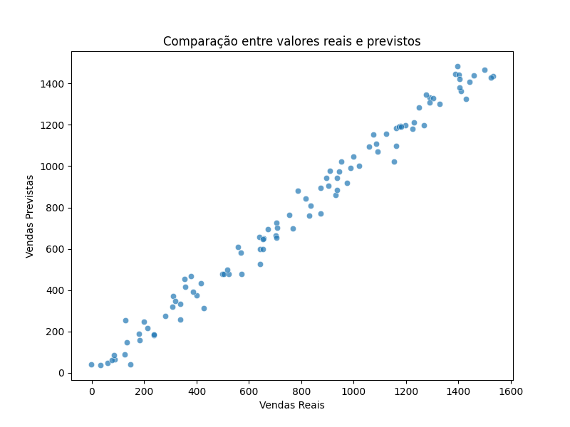

# 📈 Previsão de Vendas em E-commerce 🚀  

Oi, Mia aqui! 🌸 Este projeto nasceu da curiosidade de entender padrões de compras e prever tendências no e-commerce usando **Ciência de Dados** e **Machine Learning**. A ideia é pegar um monte de números e transformar em algo útil, ajudando a tomar decisões estratégicas de um jeito inteligente! 🧠✨  


## 📊 Visualização de Dados  
Olha só um exemplo de como a gente pode visualizar os dados:  


## 🔍 O Que Este Projeto Responde?  

- Quais produtos vendem mais e quando? 📅  
- Existem padrões sazonais nas vendas? 🎄📊  
- Como prever o faturamento futuro com base nos dados históricos? 💰  
- Quais fatores mais influenciam no volume de vendas? 📦  

Este modelo foi treinado para responder a essas perguntas e auxiliar na **tomada de decisões estratégicas** no comércio digital. 🚀  

---

## 📂 Dados Utilizados  

Este projeto utiliza um conjunto de dados de vendas, contendo as seguintes colunas:  

| Coluna | Descrição |
|--------|-------------|
| `data` | Data da venda |
| `produto` | Nome do produto vendido |
| `categoria` | Categoria do produto |
| `quantidade` | Quantidade vendida |
| `preco_unitario` | Preço unitário do produto |
| `total_vendas` | Faturamento total |

Os dados são processados e analisados para gerar **insights valiosos** sobre o comportamento do consumidor. 📊✨  

---

## 📈 Exemplo de Predição  

Aqui está um exemplo de previsão gerada pelo modelo:  

| Dia  | Vendas Reais | Vendas Previstas |
|------|-------------|-----------------|
| 01/02 | 320         | 315             |
| 02/02 | 290         | 285             |
| 03/02 | 410         | 400             |


---

## 🛠️ Tecnologias Utilizadas  
Aqui estão as ferramentas mágicas que fazem tudo acontecer:  

- 🐍 **Python** – Para processar os dados e fazer toda a mágica acontecer ✨  
- 📊 **Pandas** – Organização e manipulação dos dados (porque bagunça não dá, né?)  
- 🔢 **NumPy** – Fazendo cálculos e deixando tudo bonitinho  
- 🤖 **Scikit-Learn** – O coração da previsão, onde treinamos o modelo de Machine Learning  
- 🎨 **Matplotlib** – Para transformar números em gráficos lindos  

## 🛠️ Como Rodar Esse Projeto  

Se quiser testar e brincar com esse modelo, siga esses passinhos:  

1️⃣ Clone este repositório:  
   ```bash
   git clone https://github.com/mialiberata/ecommerce_sales_prediction.git
   cd ecommerce_sales_prediction
   
